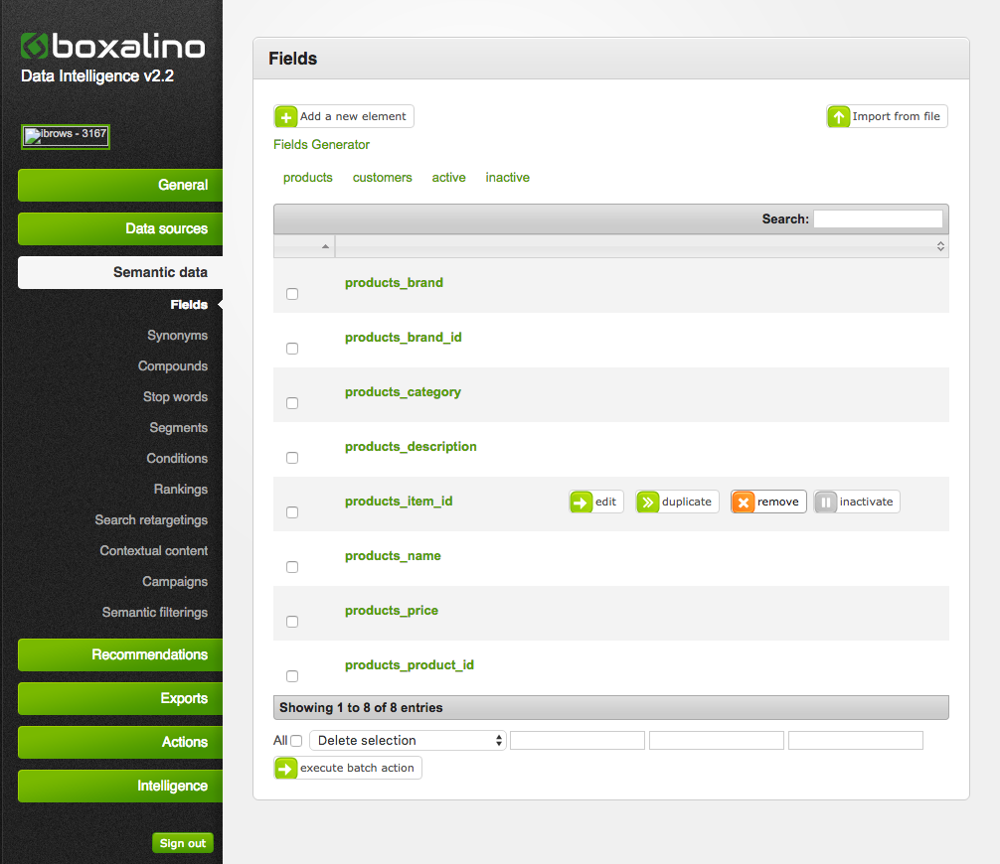

Boxalino: Remove a field from the properties
============================================

In Boxalino it is not possible to remove fields from the configuration simply by removing the field from the properties.xml.
You need to manually delete it from the semantic

Log into your [boxalino account](http://di1.bx-cloud.com/frontend/dbmind/en/dbmind/login) and navigate to 
Semantic data > fields, when you hover over the field you wish to remove, the "remove" button should appear. Click on it
and confirm.  
  
**Make sure the field is also removed in the XML**    

  

   

